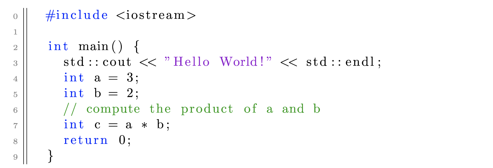

# Write Code in LaTeX


If you write
```latex
\begin{lstlisting}
	#include <iostream>
  
	int main() {
		std::cout << "Hello World!" << std::endl;
		int a = 3;
		int b = 2;
		// compute the product of a and b
		int c = a * b;
		return 0;
	}
\end{lstlisting}
```
You will get
<p align="left"> 
      
</p>
